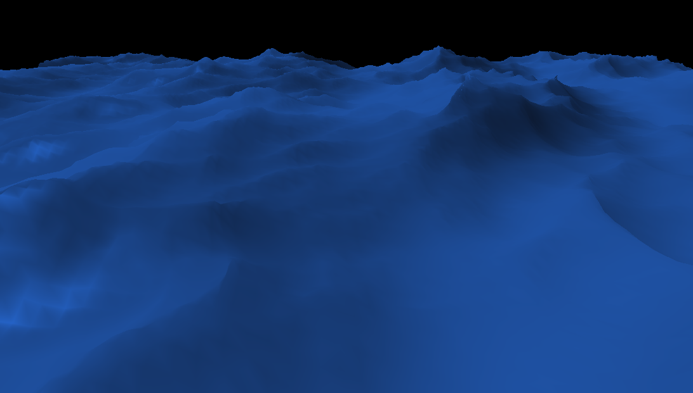
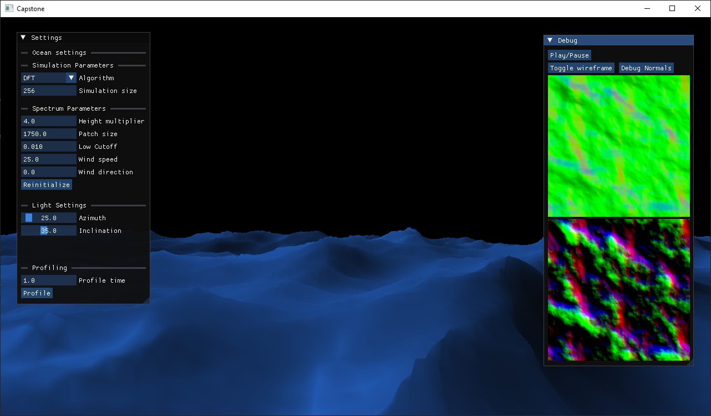

# Ocean Wave Simulation Performance Comparison



## Overview
This project aims to compare the performance of different methods for simulating ocean waves from oceanographic spectra. Specifically, it focuses on comparing the Discrete Fourier Transform (DFT) and Fast Fourier Transform (FFT) methods. It is using the Phillips spectrum, even though it is not accurate to real world conditions it fits within the purposes of the work done here. 

The project aims to compare the performance of the GPGPU versions, implemented using OpenGL compute shaders and CPU versions aswell. Additionally, performance metrics such as simulation time and computational efficiency will be analyzed with the help Python scripts.

The visualization is rudimentary, having visual artifacts and using a plastic like shader. But for the purposes of the program it is good enough. 

## Requirements
- GCC 13.2.0 (or another compiler, cannot ensure proper functionality)
- CMake 3.25.0
- Support for OpenGL 4.6

## Directory Structure
- **src/**: Contains C++ source files.
- **include/**: Contains C++ include files.
- **shaders/**: Contains OpenGL compute and visualization shaders.
- **external/**: Contains external dependencies (glm, GLFW, GL3W, fmt, ImGui).
- **build/**: Directory for build output.

## Build
1. Clone the repository including the dependencies
```shell
git clone --recurse-submodules https://github.com/Rocco2300/capstone-project
```
2. Go to the cloned repo directory and create a build folder
```shell
cd capstone-project
mkdir build
```
3. Use cmake to build project
```shell
cd build
cmake ..
cmake --build .
```
4. Now you can run it 
```shell
./capstone-project.exe
```

## Usage


You can move the camera to get the view you want of the surface. The controls are:
- W - move forward
- S - move backward
- A - move left
- D - move right
- Space - move up
- Ctrl  - move down
- Shift - speed up movement
- Right-Click and mouse move - move camera

In the settings menu you can change the algorithm used, which will take effect immediately. Aditionally you can change the simulation size and parameters of the Phillips spectrum, this requiring a reinitialization. The light settings can also be modified, they are represented in spherical coordinates, locked to being above the surface. 

In the debug menu you can view the normal and height/displacement maps generated. The debug view of the textures might look off for sizes of <256 since they are scaled to 256. The surface can be rendered in wireframe and the normals can also be visualized. To help in checking the correctness of the surface topology the simulation can be paused aswell. 

## References
- Horvath, C. J. (2015). Empirical directional wave spectra for computer graphics. Proceedings of the 2015 Symposium on Digital Production - DigiPro  ’15. doi:10.1145/2791261.2791267
- Simulating Ocean Water - Jerry Tessendorf (https://people.computing.clemson.edu/~jtessen/reports/papers_files/coursenotes2004.pdf)
- Ivan Pensionerov's implementation in Unity (https://github.com/gasgiant/FFT-Ocean) 
- Discrete Fourier Transform wikipedia page (https://en.wikipedia.org/wiki/Discrete_Fourier_transform)
- Realtime GPGPU FFT ocean water simulation (https://tore.tuhh.de/entities/publication/1cd390d3-732b-41c1-aa2b-07b71a64edd2)